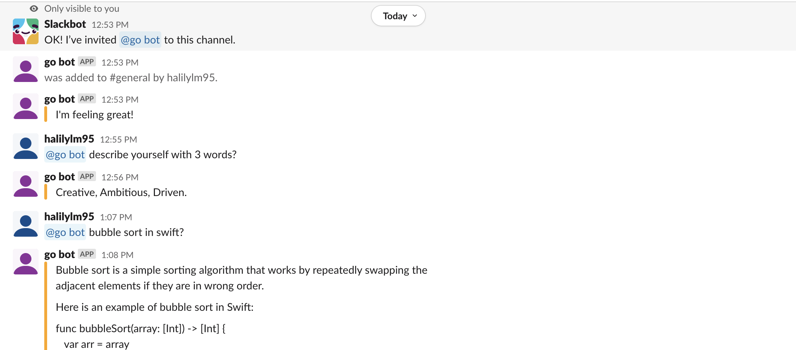

# Slack GPT bot
Slack bot talks with you via ChatGPT.

## Environment Variables

To run this project, you will need to add the following environment variables to your .env file

`SLACK_AUTH_TOKEN`: OAUTH token you get from installed app settings in slack

`SLACK_APP_TOKEN`: you get from Settings -> Basic Information -> App-Level tokens

`GPT_SECRET_KEY`: Api key you get from https://beta.openai.com/account/api-keys

`BOT_COLOR`: Bot color in hex

## Installation 

Clone the project

```bash
git clone https://github.com/halilylm/slack-chat-gpt
```

Generate `.env` file from `.env.example` and fill in fields.

```bash
cp .env.example .env
```

#### Run with docker

```bash
docker build -t slack-gpt-bot .
docker run slack-gpt-bot
```

#### Run without docker

```bash
go run *.go
```
## Demo

